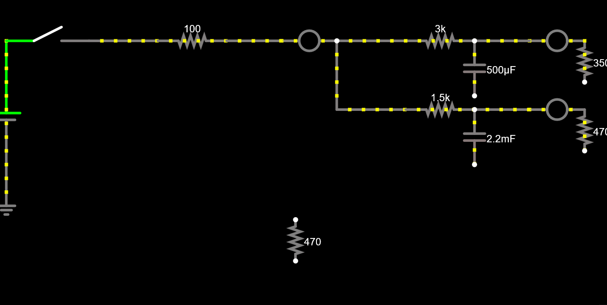
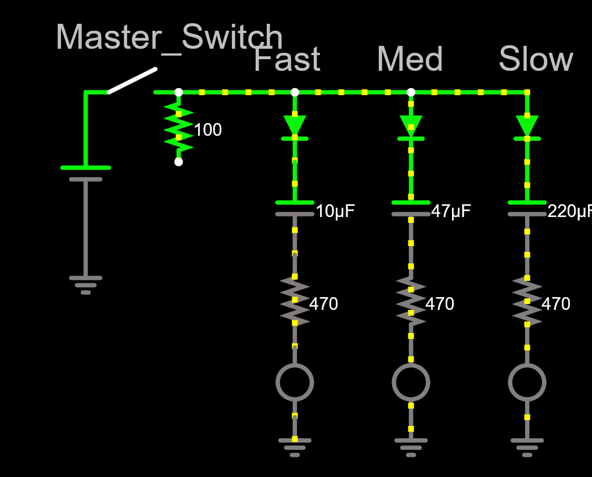
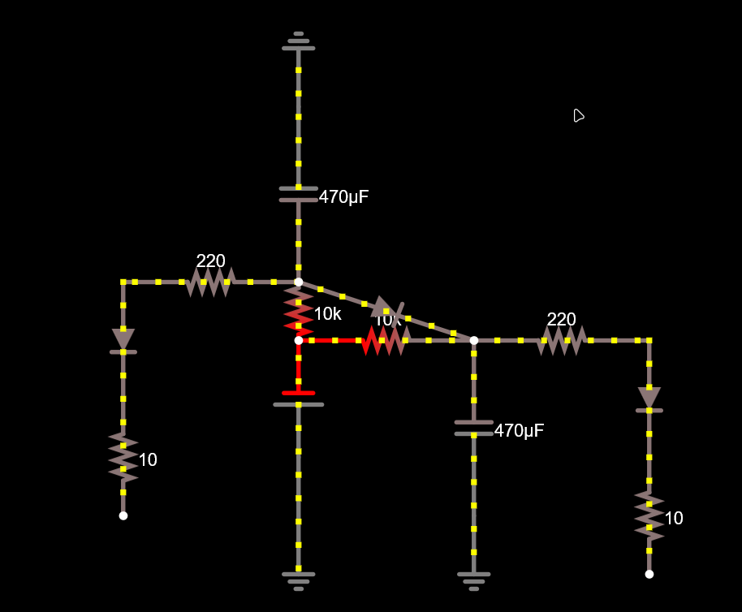

Okay so I will just journal down that one hour.

After failing miserably I slept and the next day I ran at it again. I looked through 3-4 different tutorials and the site guide aswell to know how it works, then I started experimenting. I started writing down and sketching what I needed and then Started experimenting. Heres some pictures for those 

Then I finally struck gold and after 30 minutes of trying and failing i landed on the design and how it worked. At first i didn't use ground and that made it just weird so I read the booklet found that there's ground and experimented with it. Then I made the final design and changed the numbers so they actually light up/down after eachother. I added labels too so that It shows whats happening and thats all